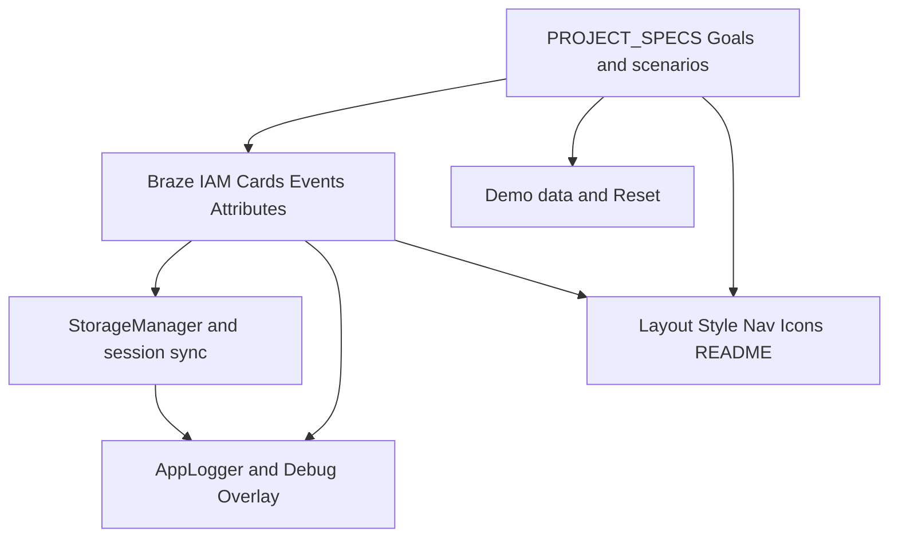

# Understanding: `.cursor/rules` expectations

This document reflects the **intent and constraints** encoded in `[.cursor/rules/](.cursor/rules/)` (PROJECT_SPECS, braze, localstorage, logging, style, readme, documentation, devops, layout/*). It is a **rules contract**, not a file-by-file audit of the current repo.

---

## 1. Product intent (`[PROJECT_SPECS.mdc](.cursor/rules/PROJECT_SPECS.mdc)`)

- **Primary goal:** High-fidelity **mobile-app-in-browser** to **showcase Braze Web SDK** (IAM, Content Cards, custom events/attributes).
- **Design philosophy — “Native illusion”:** Looks like iOS; **all interaction inside** `#phone-frame` (390×844) **except** the developer debug overlay.
- **UX:** Smooth motion, **haptic-like** feedback (e.g. scale on tap), responsive UI.
- **Priorities:** (1) Marketing data drives UI where possible, (2) **Observability** — SDK work visible via `AppLogger` + debug UI, (3) **Vercel**-friendly sharing.
- **Scenarios:** Desktop stakeholder demo (IAM inside frame), real phone (frame adapts or goes full-screen), technical audit (debugger + attributes after mock login).
- **Quality bar:** Respect **safe-area** tokens; **guard** all Braze usage; keep **README** in sync with behavior.

---

## 2. Braze integration (`[braze.mdc](.cursor/rules/braze.mdc)`)

| Expectation       | Rule detail                                                                                                                                       |
| ----------------- | ------------------------------------------------------------------------------------------------------------------------------------------------- |
| **Init**          | Load SDK from app entry (`[main.js](js/main.js)` in this project); credentials in `[config.js](js/config.js)` or env.                             |
| **Safety**        | Every call behind `if (window.braze) { ... }`.                                                                                                    |
| **Naming**        | Custom events: **Title Case - Action** (e.g. `Navigation - Tab Switched`). User attributes: **snake_case**.                                       |
| **Metadata**      | Include `**app_version`** and `**platform: "web_mobile_frame"`** with SDK/session context (rules tie this to init metadata).                      |
| **Pattern**       | **Subscribe/observer** — UI reacts to Braze callbacks; avoid ad-hoc direct SDK calls scattered in components where a bus/subscription is clearer. |
| **IAM**           | `subscribeToInAppMessage`; **contain** display inside `#phone-frame`; log via `AppLogger`; `return false` when handling display manually.         |
| **Content Cards** | **No polling**; `subscribeToContentCardsUpdates`; map cards (e.g. `extras.type === 'banner'`) to carousel/promo; log updates.                     |
| **Debug overlay** | Outside frame; toggled from **header nav**; show user profile (External ID, Braze ID, contact info) + **latest ~20 events**.                      |
| **Test user**     | Defined profile (name, email, `external_id`); `braze.changeUser` for demo login.                                                                  |
| **Demo data**     | All dynamic content from **demo objects** at load; **no** static product/content markup (except logos/fixed copy).                                |
| **Reset**         | **Reset** in **header navigation** clears **local app storage**, session, and navigation back to initial demo state.                              |

*Implementation note:* Rules also reference **Flowbite** for carousel/promo mapping; the stack may still be valid if patterns (carousel, cards) match Flowbite-style UX even when built with Tailwind/primitives.

---

## 3. Local storage (`[localstorage.mdc](.cursor/rules/localstorage.mdc)`)

- **Keys:** Prefix `**ar_app_`**; remainder **snake_case** (e.g. `ar_app_user_session`, `ar_app_theme_mode`, `ar_app_braze_init_status`).
- **Access:** **No** raw `localStorage` in UI — only via singleton `**StorageManager`**.
- **Integrity:** `JSON.parse` in **try/catch**; **defaults** for missing keys (`[]` / `{}` / `null` as appropriate).
- **Security:** No PII/passwords in clear text; tokens/preferences only.
- **Sync:** Persist state as soon as it changes (e.g. dismiss notification).
- **Braze alignment:** On load, if `**ar_app_user_id`** exists, call `**braze.changeUser(id)`** so SDK matches local session.

*Cross-check:* Layout blueprints in `[layout/layout.mdc](.cursor/rules/layout/layout.mdc)` use `--safe-top` / `--safe-bottom`; `[style.mdc](.cursor/rules/style.mdc)` uses `--safe-t` / `--safe-b` — implementations should pick **one** token set project-wide to match PROJECT_SPECS “safe area” checks.

---

## 4. Logging (`[logging.mdc](.cursor/rules/logging.mdc)`)

- **Single pipeline:** All logs through `**AppLogger`**.
- **Shape:** Timestamp + **category** (`UI`, `SDK`, `AUTH`, `STORAGE`, `SYSTEM`) + **level** (`INFO`, `DEBUG`, `WARN`, `ERROR`) + message + optional data.
- **Console:** Styled `console.log` for dev readability.
- **DEBUG_MODE:** Rules say it should be **driven from StorageManager** (current codebase often uses hostname — align with rule when extending).
- **Export:** `**getLogs()`** returning recent entries (rule example: last **50** for support/export).
- **Braze:** `**ERROR`** → custom event `**App_Error*`* with error payload.

---

## 5. Styling & layout (`[style.mdc](.cursor/rules/style.mdc)`, `[layout/layout.mdc](.cursor/rules/layout/layout.mdc)`, `[layout/navigation.mdc](.cursor/rules/layout/navigation.mdc)`)

- **Hybrid:** ~**90% Tailwind** utilities; **custom CSS** for `#phone-frame`, notch/island, IAM animations.
- **Tokens:** `:root` CSS variables for brand + `**--phone-w` / `--phone-h` / safe insets** (47px top, 34px bottom per rules).
- **Chrome:** Glass-style headers/nav where appropriate (`bg-white/80`, `backdrop-blur`, subtle borders).
- **Mobile UX:** `**select-none`** on chrome; `**min-h/w [44px]`** touch targets; `**overscroll-behavior-y: contain`** on `**#app-content**`.
- **Bottom nav:** Anchored to bottom of `**#phone-frame`**, z-index ≥ 100, height 56px + safe bottom; rules specify `**<nav>` > `<ul>`** with **4–5** items, icon+label column, `**.active`**, space-around, tap feedback.

---

## 6. Iconography (`[layout/iconography.mdc](.cursor/rules/layout/iconography.mdc)`)

- Font Awesome kit `**a21f98a3f6`** in `[index.html](index.html)` `<head>`, `**crossorigin="anonymous"`**, `**defer**`/`async` as appropriate.
- Decorative icons: `**aria-hidden="true"**`; buttons need `**aria-label**`.
- Suggested mappings (home, bell, bars, user, xmark, chevron, etc.) for consistency.

---

## 7. Documentation & code quality (`[documentation.mdc](.cursor/rules/documentation.mdc)`, `[readme.mdc](.cursor/rules/readme.mdc)`, `[devops.mdc](.cursor/rules/devops.mdc)`)

- **JSDoc:** Every **function** — purpose, `@param`, `@returns` (and types where useful).
- **README:** App title; subtitle **“A Mobile-First Web Application with iPhone Frame Layout.”** Sections: overview, tech stack (HTML5, CSS3 iPhone frame, **Flowbite**, FontAwesome kit, Braze, Vercel), setup (GitHub org link, Vercel project), **architecture** (`StorageManager`, `AppLogger`), **Braze events/attributes** list + link to [Braze Web SDK docs](https://www.braze.com/docs/developer_guide/sdk_integration/?sdktab=web), `#phone-frame` explanation. Emphasize **why** decisions were made and **handoff-ready** clarity.
- **Git:** Remote under **auzaniridzwan-oss**; **Conventional Commits** (`type(scope): description`); branches `main`, `feature/`*, `fix/`*; strong `.gitignore` (no `node_modules`, `.env`, storage dumps).
- **CI (if added):** Workflow should **lint JS/CSS** per project standards; Vercel project **auzani-ridzwans-projects**.

---

## 8. Rule layers (mental model)

---

## 9. How to use this plan

When adding features, treat the table in **§2** and bullets in **§3–§7** as a **checklist**: naming conventions, containment, subscription-only cards, storage/logging gates, safe areas, README updates, and commit hygiene. Any deliberate deviation (e.g. event naming or `user_session` vs `user_id` key) should be **documented in README** or reconciled with the rules.