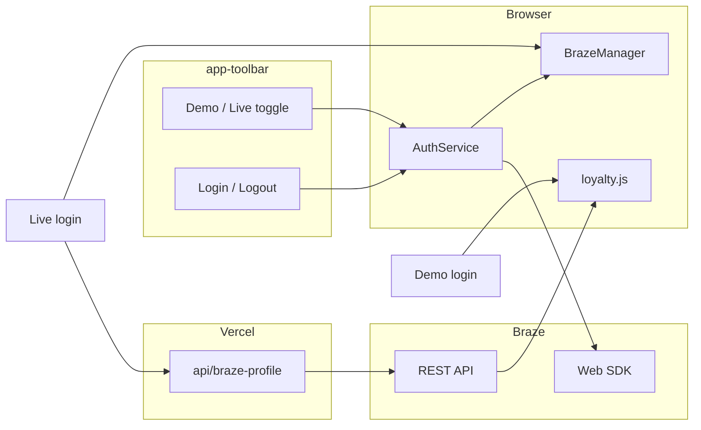

# Login, Demo/Live modes, and Loyalty from Braze

## Constraint (drives Live loyalty data)

[Braze Web SDK 6.5 `User](https://js.appboycdn.com/web-sdk/6.5/doc/classes/braze.user.html)` only **sets** attributes; it does not expose getters for dashboard/server custom attributes. So **Live** “retrieve user attributes” for the Loyalty UI will use a **Vercel serverless function** + **Braze REST API** (your choice: `yes_api`), never the SDK.

## Architecture




## 1. Storage and auth module

Add a small `**[js/auth-service.js](js/auth-service.js)**` (or equivalent name) that owns:


| `StorageManager` key | Purpose                                                                                                                                                                 |
| -------------------- | ----------------------------------------------------------------------------------------------------------------------------------------------------------------------- |
| `auth_mode`          | `"demo"`                                                                                                                                                                |
| `logged_in`          | `boolean` (default `false`)                                                                                                                                             |
| `user_session`       | Existing profile object; extend with optional `loyalty: { loyalty_id, points, tier }` for UI (or keep flat fields—match existing `BrazeManager.getUserProfile()` usage) |


APIs: `isLoggedIn()`, `getAuthMode()`, `setAuthMode(mode)`, `loginDemo()`, `loginLive(externalId)`, `logout()`, `getLoyaltySnapshot()` (reads normalized id/points/tier for the Loyalty screen).

**Logout / Braze:** Call `window.braze.wipeData()` when SDK is available so the next session is a **new anonymous user** (per SDK docs), then clear app keys (at least `logged_in`, `user_session`, any `live_loyalty` cache), `requestImmediateDataFlush` optional, then `location.reload()` for a clean re-init—aligned with how Reset already reloads.

## 2. Refactor Braze identification (`[js/braze-manager.js](js/braze-manager.js)`)

- `**_identifyUser()`** (called from `init()`): Only call `changeUser` when `AuthService.isLoggedIn()` is true.
  - **Demo:** `changeUser(TEST_USER.external_id)`, merge `[TEST_USER](js/demo-data.js)` into `user_session`, set `app_version` / `platform` as today.
  - **Live:** `changeUser(submittedExternalId)` from stored session; same metadata setters.
- If not logged in after init: `**openSession()`** still runs for an anonymous user (no `changeUser`).
- Export helpers used by Auth: e.g. `identifyDemoUser()`, `identifyLiveUser(externalId)`, `refreshLiveProfileFromServer()` (see below).

## 3. Vercel API: fetch loyalty fields (`[api/braze-profile.js](api/braze-profile.js)`)

- **Method:** `POST` JSON `{ "external_id": "..." }`.
- **Server env:** `BRAZE_REST_API_KEY` (required). **REST base URL:** e.g. `BRAZE_REST_URL` = `https://rest.iad-03.braze.com` (match your SDK cluster; `[config.js](js/config.js)` uses `sdk.iad-03.braze.com` → REST host `rest.iad-03.braze.com`).
- **Braze endpoint:** Use the documented **users export by identifier** flow (e.g. `POST /users/export/ids` with `external_ids` and `fields_to_export` including custom attributes)—parse the response and return a small JSON payload:

```json
{
  "pphg_loyalty_id": "...",
  "pphg_loyalty_points": 123,
  "pphg_loyalty_tier": "Gold"
}
```

- **Security:** Only forward the three loyalty fields (and optionally standard name/email if you want Account parity); never return the REST key. Optionally restrict `Origin` to your Vercel domain in production.

**Client:** After successful Live login, `fetch('/api/braze-profile', { method: 'POST', ... })`, then persist merged loyalty into `user_session` (or `StorageManager`) so Loyalty and Account can render offline until logout.

## 4. Toolbar UI (`[index.html](index.html)` + wire in `[js/main.js](js/main.js)`)

In `#app-toolbar` beside Debug / Reset:

- **Mode:** Two explicit controls (e.g. segmented buttons or radios): **Demo** | **Live**. Persist via `AuthService.setAuthMode`. If user switches mode while logged in, either block with a short confirm + logout, or auto-logout—pick one behavior and document in code.
- **Login / Logout:**  
  - **Demo:** “Log in” sets demo session + calls `BrazeManager` identify demo.  
  - **Live:** prompt or small modal for **external_id** (required); on submit, identify + call API + store loyalty.  
  - **Logout:** `AuthService.logout()`.

Style with existing Tailwind utility classes on the bar; keep touch targets ≥ 44px where interactive.

## 5. Bottom nav: disable Loyalty & Account (`[js/components/bottom-nav.js](js/components/bottom-nav.js)`)

- Mark items that require auth (Loyalty, Account): e.g. `data-requires-login="true"`.
- When `!AuthService.isLoggedIn()`: set `disabled` / `aria-disabled="true"`, add a class (e.g. `nav-item--locked`), **prevent** `Router.navigate` on click, use muted styles (reuse or add rules in `[css/pphg-components.css](css/pphg-components.css)` for `.bottom-nav`).
- Export `**refreshAuthState()`** (or pass auth into `render`) and call it after login/logout and on boot so the bar updates without full reload when possible; reload after logout simplifies Braze state.

## 6. Router guard (`[js/router.js](js/router.js)`)

Before rendering `/loyalty` or `/account`, if `!AuthService.isLoggedIn()`, redirect to `#/` (and optionally log `[UI]`). Prevents deep links from bypassing disabled nav.

## 7. Loyalty screen (`[js/screens/loyalty.js](js/screens/loyalty.js)`)

Replace hard-coded “Gold / 12,400 points” with values from `**AuthService.getLoyaltySnapshot()`** (or `BrazeManager` facade):


| UI label      | Source key(s)                                       |
| ------------- | --------------------------------------------------- |
| Loyalty ID    | `pphg_loyalty_id`                                   |
| Points / copy | `pphg_loyalty_points` (format number; fallback “—”) |
| Tier          | `pphg_loyalty_tier`                                 |


Keep tier progress bar as a **simple heuristic** (e.g. static subtext or tier-based width) if you do not have “points to next tier” in Braze—avoid inventing data; optional placeholder line when points missing.

## 8. Demo data (`[js/demo-data.js](js/demo-data.js)`)

Add `**DEMO_LOYALTY`** (or fields on `TEST_USER`) with `pphg_loyalty_id`, `pphg_loyalty_points`, `pphg_loyalty_tier` so Demo login populates the same mapping as Live.

## 9. Reset (`[js/main.js](js/main.js)`)

Reset button already clears all `ar_app_`* keys and reloads—ensure new keys (`auth_mode`, `logged_in`) live under the same prefix so reset returns to **logged out** + default mode.

## 10. Vercel routing (`[vercel.json](vercel.json)`)

The catch-all rewrite to `index.html` may intercept `/api/`*. Adjust rewrites so `**/api/`* is not rewritten** to the SPA (e.g. negative lookahead or list API routes first). Verify locally with `vercel dev` if available.

## 11. Observability

Use `**AppLogger`** for login/logout/mode switch, Live profile fetch success/failure, and router redirects. Log a Braze custom event if useful (e.g. `Auth - Login Completed`) with `mode: demo|live` (no PII beyond what you already log).

---

**Files touched (expected):** `[index.html](index.html)`, `[js/main.js](js/main.js)`, `[js/braze-manager.js](js/braze-manager.js)`, `[js/router.js](js/router.js)`, `[js/components/bottom-nav.js](js/components/bottom-nav.js)`, `[js/screens/loyalty.js](js/screens/loyalty.js)`, `[js/demo-data.js](js/demo-data.js)`, `[css/pphg-components.css](css/pphg-components.css)`, `[vercel.json](vercel.json)`, **new** `[js/auth-service.js](js/auth-service.js)`, **new** `[api/braze-profile.js](api/braze-profile.js)`. Optional: tiny login modal markup in JS or a thin `[js/components/login-modal.js](js/components/login-modal.js)`.

**README:** Workspace rules mention updating README for new features; you did not request README—omit unless you want env var docs (then add a short “Live profile API” subsection only).